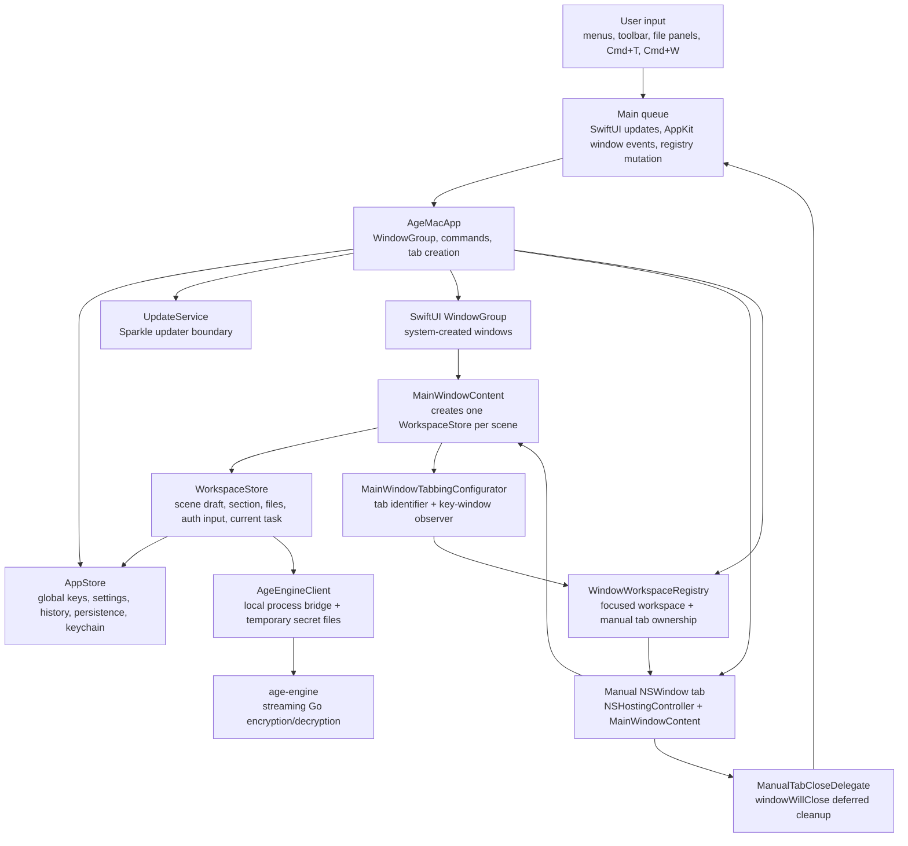
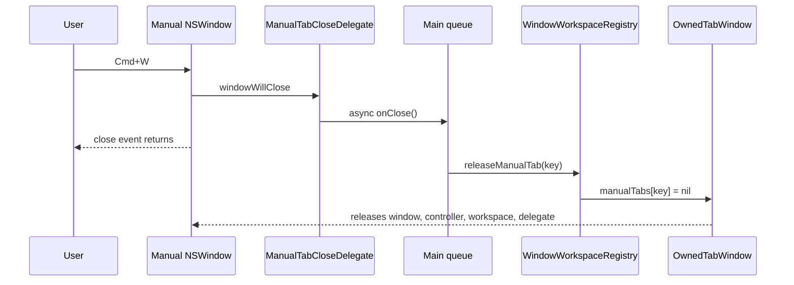

<!--
Copyright (c) 2026 vikiea <vikiea@users.noreply.github.com>
This code is released under the MIT License.
See LICENSE for details.
-->

# Scene Workspace Architecture

Age Mac separates global user data from per-window or per-tab workspaces. This lets multiple macOS windows and tabs work independently while sharing settings, keys, history, and update services.

## Component Map

## Ownership Model

`AppStore` is the shared application boundary. It owns user-level state that should be visible from every window and tab: keys, settings, operation history, persistence, keychain access, private key storage, and global alerts.

`WorkspaceStore` is the scene boundary. Each `MainWindowContent` creates a fresh `WorkspaceStore` with `@StateObject`, so every SwiftUI window or manually-created tab gets its own selected section, file lists, auth drafts, selected key IDs, running task, process handle, cancel state, and scene alert. Sensitive drafts stay in memory and are not persisted.

`WindowWorkspaceRegistry` bridges SwiftUI focus and AppKit tabs. SwiftUI commands first use `@FocusedObject` to find the active `WorkspaceStore`; if focus is unavailable, commands fall back to the registry's `focusedWorkspace`, which is updated when an Age Mac window becomes key.

## Main Queue Role

SwiftUI and AppKit window APIs are main-thread systems. Age Mac keeps window creation, focus updates, and registry mutation on the main queue so command routing and tab ownership stay serialized.

The `Cmd+W` close path is deliberately deferred by one main-queue turn:

This avoids releasing Swift-owned AppKit objects while AppKit is still unwinding the close callback.

## Tab Creation Path

`Cmd+T` creates a new tab without flashing a temporary standalone window:

1. `AgeMacApp.openMainWindowAsTab()` finds the current Age Mac key window.
2. It builds a new `MainWindowContent`, which creates a new `WorkspaceStore`.
3. It wraps the content in an `NSHostingController`.
4. It creates an `NSWindow` with `defer: true` and `isReleasedWhenClosed = false`.
5. It gives the window the shared tabbing identifier and retains it in `WindowWorkspaceRegistry`.
6. It inserts the window into the current `NSWindow.TabGroup` before making it key.

`isReleasedWhenClosed = false` means AppKit does not independently release this manually-created window during close. The registry owns the manual tab while it is open and releases it after `windowWillClose` returns.

## Task Flow

Encryption and decryption start from the active `WorkspaceStore`, not from `AppStore`. A workspace reads its own draft, invokes `AgeEngineClient`, updates its own current task card, and writes completed operation records back into the global `AppStore` history.

Multiple tabs can therefore run independent engine processes at the same time. Cancelling a task only affects the focused workspace because each workspace owns its own `activeProcess`, `activeRecordID`, and cancel state.
